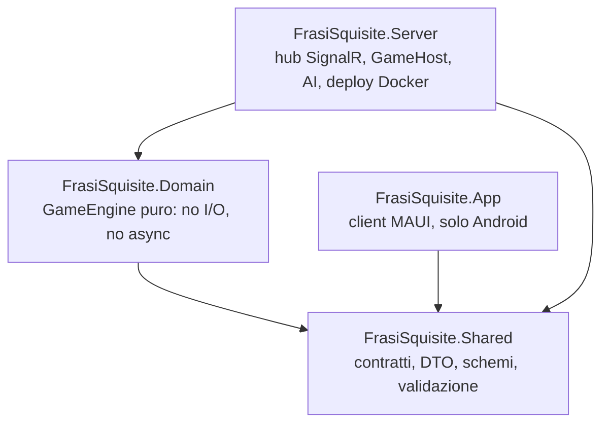
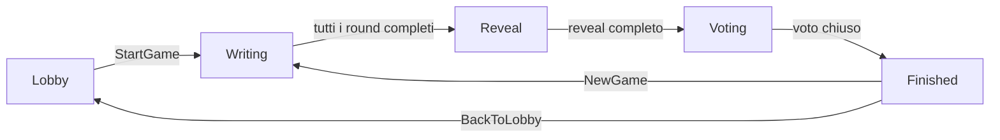

# System architecture

Quattro progetti .NET 10 con dipendenze **rigorosamente unidirezionali**:
`Shared` non dipende da nessuno; `Domain` e `App` dipendono solo da
`Shared`; `Server` dipende da `Domain` e `Shared`. `Domain` non conosce
SignalR, HTTP né alcun I/O.

## Il motore restituisce effetti, non li esegue

`IGameEngine.Handle(GameState, GameEvent) -> EngineResult(GameState,
IReadOnlyList<Effect>)`. `Effect` è un tipo somma (record):
`SendToPlayer`, `BroadcastToRoom`, timer, chiamate AI. `GameHost` (in
`Server`) è l'adapter sottile che esegue gli effetti — SignalR, timer
reali, chiamate HTTP alle AI.

Conseguenza diretta: un test del motore asserisce sugli `Effect`
prodotti senza mockare rete né usare un vero hub. Una partita completa
si simula in millisecondi. Questo pattern (motore puro + adapter
sottile) è la decisione architetturale singola più citata nello storico
del progetto — vedi [[motore-effetti-non-esecuzione]].

## GameEngine, spezzato per fase

`GameEngine` è `partial class`, un file per fase di gioco
(`GameEngine.Writing.cs`, `GameEngine.Reveal.cs`,
`GameEngine.Refining.cs`, `GameEngine.Players.cs`, …) — refactor
deliberato dopo che il file unico è diventato troppo grande durante il
lotto voto (vedi [[refactor-gameengine-partial]]).

## Stato della stanza (macchina a stati)

Nota: non esiste un timer di scadenza per round nel `Writing` — il
riempimento automatico di una casella (bot che subentra) scatta solo
alla **disconnessione** del giocatore, non a un timeout del turno.
Diverge da quanto ipotizzato nella spec originale (§2.2, "il round
avanza... o è scaduto il timer") — vedi [[persistenza-mai-implementata]]
per altri scostamenti dal piano iniziale.

## Testabilità come vincolo di design

Tempo e casualità sono dipendenze iniettate (`TimeProvider`,
`IRandomSource`), mai chiamate dirette a `DateTime.UtcNow`/`Random`. Ogni
dipendenza esterna sta dietro un'interfaccia con un **fallback che è
un'implementazione vera**, non un `if` sparso — es. `IAiTextProvider`/
`IAiImageProvider` degradano a `DisabledAiTextProvider`/
`DisabledAiImageProvider` quando manca la chiave API, e il gioco resta
interamente giocabile. Vedi [[fallback-come-implementazione]].

## Stato vivo: solo in memoria

`IRoomRegistry`/`RoomRegistry` tengono lo stato delle stanze attive
**solo in RAM**, nessuna persistenza su riavvio del server. La spec
originale prevedeva Postgres + EF Core + cifratura AES-GCM dei campi
(fase 3 del piano) — **mai implementata**: vedi
[[persistenza-mai-implementata]]. Le immagini generate vivono in
`ImageStore`, anch'esso in memoria con sfratto FIFO, non su disco
cifrato come da spec.

## Sviluppo guidato da subagent (processo, non codice)

Le feature recenti (rientro in partita, overlay illustrazione, reveal
fluido) sono state costruite con un flusso brainstorming → spec →
piano → subagent-driven-development → revisione di ramo intero →
merge, tracciato in `docs/superpowers/`. Non è parte del runtime, ma è
il motivo per cui lo storico git ha commit granulari e messaggi che
spiegano il perché, non solo il cosa.
