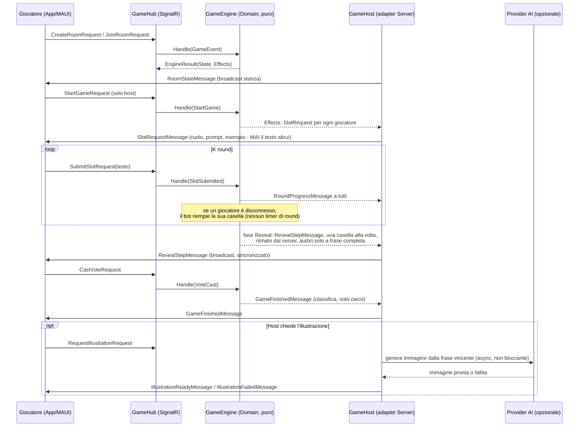

# Key flows

Una partita completa, dalla creazione della stanza alla classifica
finale con illustrazione opzionale. Ogni giocatore riempie una casella
grammaticale (soggetto, aggettivo, verbo…) **senza vedere le altre**
della stessa frase — la segretezza è una proprietà del protocollo
(`SlotRequestMessage` porta solo ruolo/prompt/esempio, mai testo di
altre caselle), non una scelta di presentazione. Vedi
[[segretezza-di-protocollo]].

## Rientro dopo disconnessione

Percorso separato, aggiunto dopo il nucleo iniziale (vedi
[[rientro-in-partita]]): alla disconnessione SignalR, `GameHub` non
espelle subito — avvia un **periodo di grazia di 30s** in `GameHost`
(salvo in fase `Lobby`, dove l'espulsione è immediata). Se il client
rientra entro la grazia (`RejoinRoomRequest` con lo stesso `playerId`),
il motore rimanda il messaggio della fase corrente esatta — incluso il
caso "la tua casella era già stata riempita dal bot" — senza che il
giocatore perda nulla. Il client tenta il rientro da tre punti: avvio a
freddo (`OnAppearing`), `Window.Resumed`, e riconnessione di trasporto
(`OnReconnected`), leggendo la stanza salvata da `IRoomSession`.
