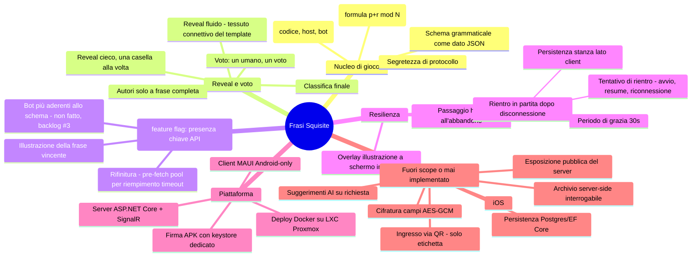

# Feature mindmap

Le pagine di categoria decisione collegate a ciascun ramo raccontano il
perché, non solo il cosa — vedi in particolare [[rientro-in-partita]] e
[[persistenza-mai-implementata]] per i due rami con più storia.
