# Roadmap

La spec originale (2026-07-29) prevedeva 5 fasi. Confrontando con
`git log` e il codice attuale, lo stato reale diverge dal piano su un
punto importante: la fase 3 (persistenza) non è mai stata affrontata,
mentre fasi successive non previste nel piano originale (rientro in
partita, overlay immagine) sono state aggiunte come lotti a sé.

```mermaid
gantt
    title Fasi pianificate vs. stato reale (non in scala temporale)
    dateFormat X
    axisFormat %s

    section Pianificato e fatto
    Nucleo (motore, hub, client MAUI, schema unico)      :done, f1, 0, 1
    Robustezza (voto, passaggio host, schema multipli)   :done, f2, 1, 2
    AI (rifinitura + illustrazione, con degrado)         :done, f4, 2, 3
    Rifinitura UX (reveal teatrale/fluido, illustrazione) :done, f5, 3, 4

    section Pianificato, mai fatto
    Persistenza (Postgres, cifratura, archivio, event log) :crit, f3, 4, 5

    section Non pianificato, fatto comunque
    Rientro in partita dopo disconnessione               :done, extra1, 5, 6
    Overlay illustrazione a schermo intero                :done, extra2, 6, 7
```

## Backlog aperto (fonte: `docs/superpowers/backlog.md`, aggiornato più
spesso di questa pagina — verificarlo per lo stato corrente)

1. **Ingrandire l'illustrazione toccandola** — *risolto*, vedi lo storico
   git (`feature/illustrazione-overlay`, merge `351fcd1`); il backlog
   verrà rinumerato al prossimo aggiornamento.
2. **Fallimento intermittente di `GameHubTests`** — flake pre-esistente
   diagnosticato (fame di thread nel pool: `WebApplicationFactory` per
   ogni test, nessun `xunit.runner.json`, `Dispose()` sincrono su un
   host `IAsyncDisposable`). Non blocca il prodotto, ma un test ballerino
   nasconde il prossimo difetto vero.
3. **Bot più aderenti allo schema** — secondo pezzo del lotto AI, mai
   fatto: una cache di `IWordPool` per schema, con fallback su
   `StaticWordPool`. Il motore non cambia.
4. **Rilievi minori** — sette voci non bloccanti (elenco completo nel
   backlog): test mancante sulla retrocessione host, `ImageStore.Salva`
   nullable non imposto, finestra di corsa fra illustrazione e nuova
   partita, percorso immagine non a prova di reverse-proxy con
   prefisso, sfratto FIFO globale fra stanze, apostrofi ASCII nei
   commenti, nessun tetto al costo AI.

## Non pianificato esplicitamente, ma implicito nello scarto dal design

- **Persistenza/cifratura** (spec §7): se mai ripresa, è un lotto grosso
  a sé — vedi [[persistenza-mai-implementata]] per cosa comporterebbe.
- **Pubblicazione Play Store**: la spec tiene la porta aperta
  architetturalmente ma nessun passo concreto risulta preso in questa
  direzione.
